# Rancangan Arsitektur Sistem Informasi Pendaftaran & Monitoring UKM (PRM)

## 1. Diagram Arsitektur Sistem (High-Level System Architecture)

> [!TIP]
> Panduan Desain Visual Neo-Brutalism Hijau & Komponen UI Tokens telah dirangkum dalam [DESIGN_SYSTEM.md](file:///D:/PRM/DESIGN_SYSTEM.md).

```mermaid
graph TB
    subgraph Sisi Client (Frontend App)
        FE[Web App / Mobile Responsive Form]
        LS[(Browser LocalStorage - Auto Save Draft)]
    end

    subgraph API Gateway & Security Layer
        NGINX[Reverse Proxy / Load Balancer]
        RL[Rate Limiter Middleware]
    end

    subgraph Service Backend App
        API[REST API Engine / App Controller]
        subgraph Auth Module (Adapter Pattern)
            AUTH_INT[Auth Strategy Interface]
            OTP_PROV[Phone OTP Provider]
            SSO_PROV[Unesa SSO Provider - Future]
        end
        GUARDS[Business Logic Guards & Middlewares]
    end

    subgraph Service Eksternal & Caching
        GW[WhatsApp / SMS OTP Gateway]
        REDIS[(Redis Cache - Rate Limit & Sessions)]
    end

    subgraph Persistence Layer
        DB[(Relational Database - PostgreSQL 16 Native)]
    end

    FE <-->|Auto Sync Draft| LS
    FE <-->|HTTPS REST Requests| NGINX
    NGINX --> RL
    RL --> API
    API --> AUTH_INT
    AUTH_INT --> OTP_PROV
    AUTH_INT -.-> SSO_PROV
    OTP_PROV <-->|Send SMS/WA| GW
    API <-->|Rate Limit & Caching| REDIS
    API <-->|Atomic Transactions & Row Locks| DB
```

---

## 2. Struktur Modul & Layer Aplikasi

Sistem menggunakan **Clean Layered Architecture** untuk memisahkan tanggung jawab modul:

1. **Presentation Layer (Frontend):**
   - Halaman Login & Register Email UNESA
   - Form Pendaftaran Mahasiswa (5 Field Wajib: Nama, NIM, Fakultas, Prodi, No. WhatsApp + Pilih UKM)
   - Dashboard Mahasiswa (Status Pendaftaran & Detail UKM di Route `/`)
   - Dashboard Pengurus UKM (Approval Workflow & Export Excel di Route `/pengurus`)
   - Module `AutoSaveDraft` (`localStorage`) & `SessionManager`

2. **API & Middleware Layer:**
   - Auth Middleware (Session Token Validator)
   - Single Account Guard (Verifikasi Keunikan NIM & Email)
   - Single UKM Guard (Verifikasi `status IN ('PENDING', 'ACCEPTED') == 0`)
   - Anti Spam & Rate Limiter Middleware

3. **Core Domain & Service Layer:**
   - `AuthService` (Email & Password Security Validation)
   - `PendaftaranService` (Atomic Transaction & Row Locking)
   - `UkmService` & `ApprovalService`

4. **Data Access & Storage Layer:**
   - Relational Database (Tabel `users`, `mahasiswa`, `ukm`, `pendaftaran_ukm`, `fakultas`, `program_studi`)
   - PostgreSQL 16 Native Database di Disk D (`D:\PostgreSQL\data`)

---

## 3. Skema Database (ERD & DDL Reference)

```mermaid
erDiagram
    users ||--o| mahasiswa : "has profile"
    mahasiswa ||--o{ pendaftaran_ukm : "submits"
    ukm ||--o{ pendaftaran_ukm : "receives"
    users ||--o{ pendaftaran_ukm : "approves (pengurus/superadmin)"

    users {
        uuid id PK
        string email UK "Primary login identifier"
        string password_hash "Hashed strict password"
        enum role "'mahasiswa', 'pengurus', 'superadmin'"
        boolean is_profile_completed
        datetime created_at
        datetime updated_at
    }

    mahasiswa {
        uuid id PK
        uuid user_id FK, UK
        string nama
        string nim UK "Guarantees 1 Student = 1 Profile"
        string fakultas
        string prodi
        string no_hp
        string email
        datetime created_at
        datetime updated_at
    }

    ukm {
        string id PK
        string nama
        string kategori
        text deskripsi
        string logo
        string pembina
        enum status "'open', 'closed'"
    }

    pendaftaran_ukm {
        string id PK
        uuid mahasiswa_id FK
        string ukm_id FK
        string ukm_nama
        enum status "'PENDING', 'ACCEPTED', 'REJECTED', 'CANCELLED'"
        text catatan_penolakan
        datetime created_at
        datetime updated_at
    }
```



---

## 4. Spesifikasi Endpoint REST API

### A. Otentikasi & Profile
- `POST /api/pendaftaran` : Mendaftarkan peserta mahasiswa baru.
- `GET /api/pendaftaran` : Mengambil daftar seluruh pendaftaran mahasiswa.
- `PATCH /api/pendaftaran` : Mengubah status pendaftaran (Approve, Reject, Cancel).
- `GET /api/fakultas` : Mengambil katalog 13 Fakultas & 119 Program Studi.

---

## 5. Peran & Hak Akses Pengguna (Role-Based Access Control / RBAC)

Sistem Informasi Pekan Raya Mahasiswa UNESA 2026 menerapkan **3 Peran Utama** dengan batasan akses yang jelas dan terarah:

### A. Role `mahasiswa` (Peserta Pendaftaran UKM)
* **Wewenang & Hak Akses:**
  - Melakukan otentikasi login/daftar menggunakan Email UNESA.
  - Memiliki akses ke halaman pendaftaran utama di route `/`.
  - Mengisi 5 data awal biodata (Nama, NIM, Fakultas, Prodi, No. WhatsApp aktif).
  - Memilih **1 UKM** dari 65 katalog UKM resmi UNESA (4 Kategori Ringkas: *Olahraga & Bela Diri*, *Seni & Budaya*, *Penalaran & Keilmuan*, *Kerohanian*, *Kepemimpinan & Pengabdian*).
  - Memantau status pendaftaran pribadi (`PENDING`, `ACCEPTED`, `REJECTED`, `CANCELLED`).
  - Membatalkan pendaftaran pribadi jika status masih `PENDING`.
* **Batasan Security & System Guard:**
  - Dibatasi oleh **Strict 1 UKM Guard** (tidak dapat mendaftar di UKM lain selama pendaftaran aktif).
  - Dilarang mengakses route dashboard pengurus (`/pengurus`).

### B. Role `pengurus` (Pengurus UKM Kampus - Scoped Multi-Tenant)
* **Wewenang & Hak Akses:**
  - Melakukan otentikasi login menggunakan email & password khusus pengurus (contoh: `pengurus.menwa@unesa.ac.id`, `pengurus.futsal@unesa.ac.id`) di route `/pengurus`.
  - Memiliki akses ke Dashboard Verifikasi Pendaftaran UKM khusus di route `/pengurus`.
  - Memantau pendaftar mahasiswa baru yang mendaftar ke UKM yang dikelolanya secara *real-time*.
  - Menyetujui pendaftaran mahasiswa (`APPROVE` $\rightarrow$ status `ACCEPTED`).
  - Menolak pendaftaran mahasiswa (`REJECT` $\rightarrow$ status `REJECTED` + catatan alasan penolakan).
  - Mengunduh rekapitulasi data pendaftar khusus UKM-nya dalam format Excel (`.xlsx`).
* **Isolasi Keamanan (Tenant Data Isolation):**
  - **Terkunci Otomatis (Locked Filter):** Pengurus hanya dapat melihat, menyetujui, dan mendownload rekap pendaftar untuk UKM yang dikelolanya. Pengurus tidak memiliki akses untuk melihat atau mengubah data dari 64 UKM lainnya.

### C. Role `superadmin` (Administrator Utama Kampus)
* **Wewenang & Hak Akses (Master Control & Override):**
  - Akun resmi utama: `nurdhuha.23100@mhs.unesa.ac.id`.
  - Memiliki akses **Master Penuh Lintas Route** di `/` dan `/pengurus`.
  - Berpindah halaman dengan cepat menggunakan tombol pintas navigasi di Navbar (`[Pendaftaran Mahasiswa]` $\leftrightarrow$ `[Dashboard Pengurus]`).
  - Bypass aturan Strict 1 UKM Guard untuk kebutuhan pengujian, audit, dan penanganan kendala pendaftaran mahasiswa.
  - Memantau data pendaftar di seluruh 13 Fakultas, 119 Prodi, dan 65 UKM UNESA.
  - Mengatur ulang status pendaftaran dan akun pendaftar jika terjadi kesalahan input.
* **Tampilan Visual:**
  - Dilengkapi badge identitas khusus **`⚡ SUPERADMIN`** pada menu akun di Navbar.

---

## 6. Mekanisme Proteksi & Keandalan (Google Forms Level & Integrity)

| Kategori | Mekanisme | Implementasi Teknis |
| :--- | :--- | :--- |
| **Proteksi 1 Akun** | Unique Constraint Database | `UNIQUE(email)` pada tabel `users` + `UNIQUE(nim)` pada tabel `mahasiswa`. |
| **Proteksi 1 UKM** | Multi-Layer Validation | Query Backend `WHERE mahasiswa_id = :id AND status IN ('PENDING', 'ACCEPTED')` + Database Row Locking. |
| **Auto-Save Draft** | LocalStorage Sync | Form tersimpan otomatis di browser secara *real-time* jika sinyal terputus (`useAutoSaveDraft`). |
| **Concurrency Lock** | Database Transaction | Menggunakan `BEGIN ... COMMIT` & `SELECT FOR UPDATE` saat insert pendaftaran di `/api/pendaftaran`. |

---

## 7. Spesifikasi Teknologi (Detailed Tech Stack & Infrastructure)

- **Frontend Framework:** Next.js 14.2 (App Router) + React 18
- **Styling UI:** Tailwind CSS (Soft Neo-Brutalism Design Tokens)
- **Database Engine:** PostgreSQL 16 Native Database (Disk D: `D:\PostgreSQL\data`)
- **Backend API:** Next.js Server Endpoints (`/api/pendaftaran`, `/api/fakultas`)
- **Data Export:** ExcelJS Engine (`.xlsx` Sheet Generator)
